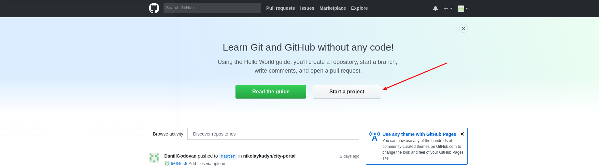
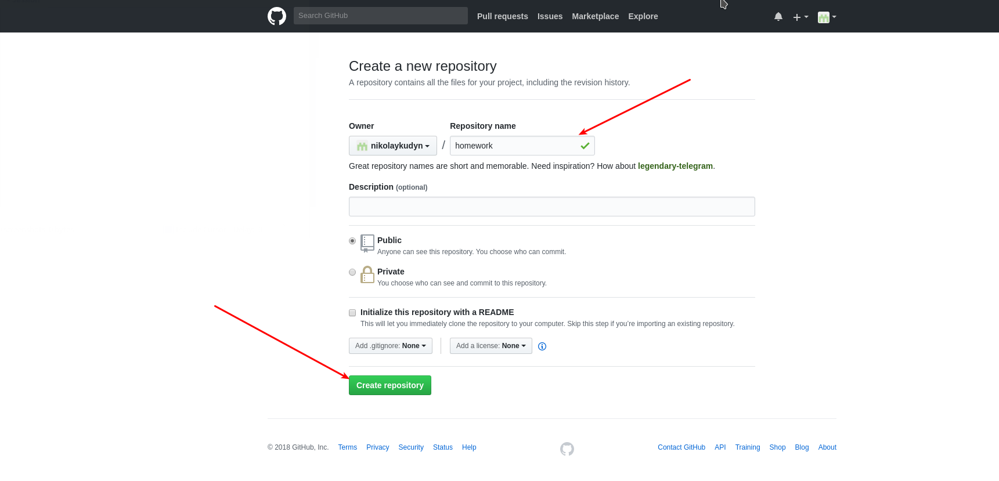
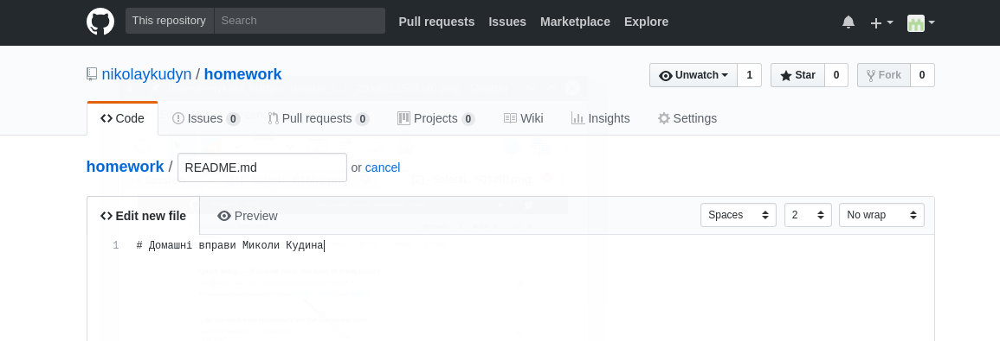
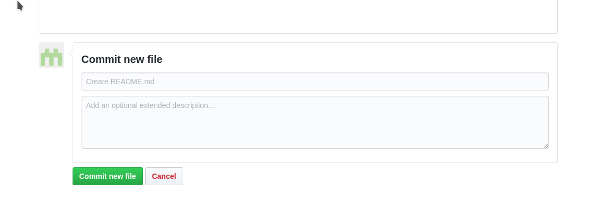
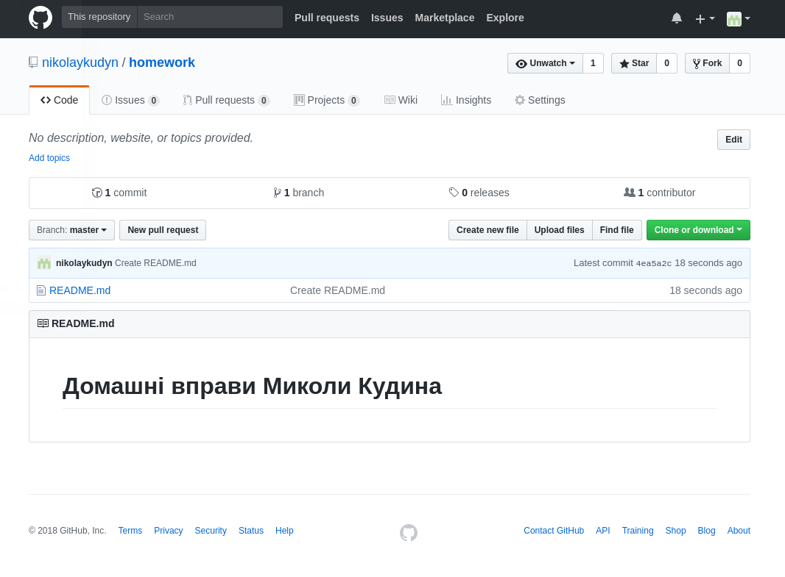

# Довідкова інформація про Git та GitHub

## Як створити новий репозиторій на GitHub

1. Зайти в GitHub

1. Натиснути кнопку `Start a project`

1. Ввести `homework` в поле `Repository name` і натиснути кнопку `Create repository`

1. Натисніть посилання `README` для створення файлу `README.md`

1. У полі введення тексту введіть `# Домашні завдання <ім'я, прізвище>`

1. Перемістіться у нижню частину сторінки та натисніть кнопку `Commit new file`

Результат:

## Як поділитися посиланням на репозиторій

1. Після створення репозиторію скопіювати посилання на нього із адресної строки і надіслати через slack
